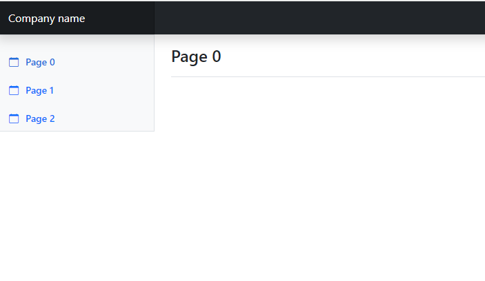

# Dashboard template

Minimal one using bootstrap, derived from [bootstrap 5.3 examples](https://getbootstrap.com/docs/5.3/examples/)

The main advantage of this one is we are loading common components via js, without any external framework. 

This way, we can easily add additional pages unlike regular templates available.. 

Simply re use `index.html` file for additional files, and update `templates/sidebar.html` for the sidebar links to access those additional pages.. `index.html` is page 0 and also home page of dashboard.. 

